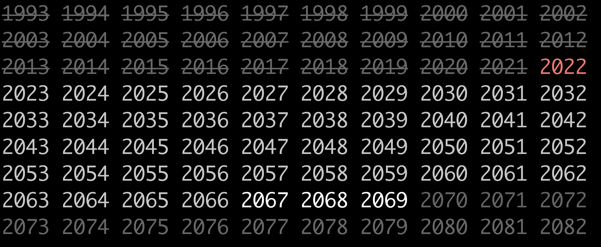

### this program outputs life expectancy

#### install:
```
git clone https://github.com/itonyluke/life_expectancy life_expectancy
```

#### compile:
`g++ life_expectancy.cpp`

#### run:
`./a.out or ./a.exe`



###### built and tested on Darwin Kernel Version 18.7.0: Tue Jun 22 19:37:08 PDT 2021; root:xnu-4903.278.70~1/RELEASE_X86_64 x86_64
